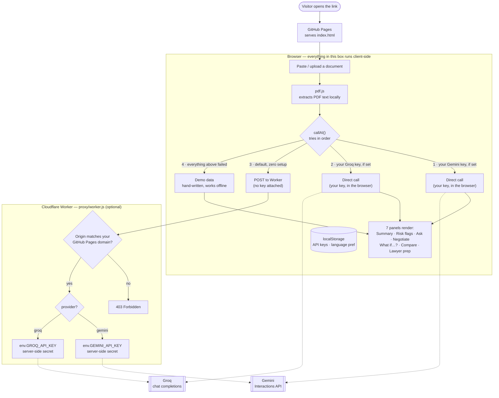

# Spashta — plain-language legal help

A GenAI solution for making legal information and basic legal assistance
more accessible. Paste or upload a
legal document (lease, offer letter, policy, ToS) and get:

- a plain-language summary
- clause-by-clause risk flags (high / medium / low) with a suggested fix
- a chat grounded in that document
- **a ready-to-send negotiation email** drafted from the flagged clauses
- **a side-by-side document comparison** (e.g. two job offers)
- **a one-page "prep for a lawyer" briefing** to make a paid consultation shorter and cheaper

It's a single static HTML file — no build step, no backend, no database.

## Why this and not just "another contract summarizer"

Every legal-AI hackathon demo explains a document. Understanding a bad clause
doesn't fix it — most people who read "this deposit clause is unusually
harsh" still don't know what to *do* about it, or can't justify paying a
lawyer ₹2,000+ just to ask three questions. The three features that aren't
in the obvious version of this product:

1. **Negotiation script generator** — turns "here's what's wrong" into an
   actual email you can send today, with specific asks and fair alternative
   wording.
2. **"Prep me for a lawyer" mode** — a structured briefing (facts, red
   flags, sharp questions) that cuts a first consultation from ~45 minutes
   of explaining context down to ~15 minutes of actual advice.
3. **WhatsApp-first distribution (roadmap, not in this demo)** — the people
   who most need this are less likely to visit a website than to forward a
   photo of a document on WhatsApp. The Meta Cloud API free tier (1,000
   conversations/month) makes a real pilot free to run.

Bilingual (EN/Hindi) UI and AI output is built in for the same reason:
legal literacy tools that only work in English miss a large share of the
people who need them most.

### A few more out-of-the-box touches

- **"What if…?" scenario simulator** — instead of just listing risky
  clauses in the abstract, pick a real worry ("I might need to relocate
  for work", "the landlord isn't returning my deposit") and get an answer
  grounded in the actual document, with a concrete next step. This is
  arguably the single most useful tab for someone who already skimmed the
  summary but doesn't know what to *do*.
- **Fairness score + financial exposure banner** — a single number
  (e.g. "42/100 — worth negotiating before you sign") plus a plain rupee
  figure for the worst case ("₹3,36,000 at risk if you leave early"),
  so the risk isn't just qualitative, it's a number you can act on.
- **Jargon Buster** — legal terms like "lock-in," "forfeited," or
  "indemnify" are underlined inline; tap one for a one-line plain-English
  definition, no separate glossary page to hunt through.
- **Read aloud** — every summary and negotiation script can be read out
  loud using the browser's built-in text-to-speech (zero cost, zero
  extra dependency, works offline) — useful for low-literacy users or
  anyone who'd rather listen than read a wall of text.
- **"Copy for a second opinion"** — a one-tap, WhatsApp-ready summary of
  the document and its biggest red flags, formatted to forward to a
  trusted friend or family member before making a decision — distinct
  from the lawyer-briefing copy, which is written for a professional.
- **A relevant "did you know?"** — e.g. that 11-month leases in India are
  common specifically to dodge mandatory registration and stamp duty —
  small, locally-accurate context that a generic legal-AI tool wouldn't
  know to surface.

## Running it

Just open `index.html` in a browser — everything runs client-side. No `npm
install`, no server.

- **Demo mode (default):** every panel shows realistic, hand-written sample
  output for the included sample lease and sample job-offer comparison.
  This is what a judge sees with zero setup.
- **Live mode:** click the "API key" button top-right and paste a free
  Google Gemini key, a free Groq key, or both. Every panel then calls the
  model live on your own pasted or uploaded text instead. With both keys
  set, Spashta tries Gemini first and automatically falls back to Groq if
  Gemini is rate-limited or overloaded — either key alone is enough to
  turn live mode on.

## Deploying it for free

Any static host works since there's no backend. Pick one:

| Host | Steps | Cost |
|---|---|---|
| **GitHub Pages** | Push this folder to a GitHub repo → Settings → Pages → deploy from `main` branch | Free |
| **Netlify** | Drag the folder onto app.netlify.com/drop | Free |
| **Vercel** | `vercel deploy` in this folder (no config needed) | Free |
| **Cloudflare Pages** | Connect the repo, no build command needed | Free |

All four give you a free `*.pages.dev` / `*.vercel.app` / `*.netlify.app` /
`*.github.io` subdomain. A custom domain (optional, not required for a
hackathon demo) is typically ₹800–1,000/year from any registrar.

### Getting free API keys (for live mode)

**Gemini** (primary): go to `aistudio.google.com/apikey`, sign in, click
"Create API key" — no credit card required. The free tier covers roughly
1,500 requests/day on Gemini 3.8 Flash.

**Groq** (fallback, optional but recommended): go to
`console.groq.com/keys`, sign up, generate a key — also no card required.
Groq's free tier has no daily credit budget, only a per-minute rate limit,
which makes it a good backstop for whenever Gemini's daily quota or
capacity is the thing blocking you.

Paste either or both into Spashta's API key modal (⚙ top-right) if you want
to use your own quota. This is entirely optional — see below.

**Note:** live API calls work once this page is self-hosted. If you're
viewing this as a Claude Artifact preview, outbound API calls are sandboxed
and it will gracefully fall back to demo output — that's expected, not a bug.

## Deploying the AI proxy (optional — makes live AI work with zero setup)

By default, live mode requires each visitor to paste their own free API
key. For a hackathon submission, that's friction an evaluator shouldn't
have to deal with just to see the real thing work. The fix: a small
**Cloudflare Worker** (free, no card, 100,000 requests/day) that holds
*your* keys server-side and proxies requests for every visitor. No key is
ever shipped to the browser — the Worker is the only place they live.

This is optional. Without it, the site still works exactly as described
above (BYO key, or demo output). With it, live AI just works for anyone
who opens the link.

**What it does and doesn't protect against:** the Worker checks the
request's `Origin` header and only answers requests from your exact
GitHub Pages domain, with CORS locked to the same origin — this stops
casual scraping and embedding-elsewhere. It does *not* add user auth or
rate limiting beyond what Gemini/Groq's own free tiers already enforce,
so someone who inspects your site's Network tab could technically replay
requests against your proxy. Since both keys are free-tier with no
billing attached, the worst case is your daily quota gets used up, not a
bill — an appropriately-scoped protection for a judging window, not a
production auth system. Rotate/delete the keys once judging ends if you
want to close even that door.

### Setup (~10 minutes)

1. Go to [dash.cloudflare.com](https://dash.cloudflare.com), sign up free
   (no card required).
2. **Workers & Pages → Create → Create Worker.** Give it any name (e.g.
   `spashta-proxy`) and deploy the default template first.
3. Click **Edit code**, delete the placeholder content, and paste in the
   contents of [proxy/worker.js](proxy/worker.js) from this repo.
4. In that file, confirm `ALLOWED_ORIGIN` matches your GitHub Pages URL
   exactly (`https://<your-username>.github.io`).
5. Click **Deploy**.
6. Go to the Worker's **Settings → Variables and Secrets** and add two
   **secret** (encrypted) variables: `GEMINI_API_KEY` and `GROQ_API_KEY`,
   using the free keys from the section above. Secrets aren't visible
   again after saving, only usable by the Worker.
7. Copy the Worker's URL (shown at the top of its dashboard page, looks
   like `https://spashta-proxy.<your-subdomain>.workers.dev`).
8. In `index.html`, find `const PROXY_URL = '';` near the top of the
   `<script>` block and paste your Worker's URL between the quotes.
9. Commit and push — GitHub Pages redeploys automatically, and live AI
   now works for anyone who opens your link, no key needed.

To turn it off later, just clear `PROXY_URL` back to `''` and push — the
site falls back to BYO-key / demo mode immediately.

## What this costs, in full

| Piece | Free option used here | Free limit | Cost to start |
|---|---|---|---|
| AI model | Google Gemini 3.8 Flash API | ~1,500 requests/day | ₹0 |
| AI model (fallback) | Groq API (Llama 3.3 70B) | Rate-limited only, no daily cap | ₹0 |
| Hosting | GitHub Pages / Netlify / Vercel / Cloudflare Pages | Unlimited static hosting | ₹0 |
| PDF reading | pdf.js (runs in-browser) | No server, no limit | ₹0 |
| Storage | Browser `localStorage` only | No DB needed for MVP | ₹0 |
| WhatsApp channel (roadmap) | Meta WhatsApp Cloud API | 1,000 free conversations/month | ₹0 |
| Custom domain (optional) | — | — | ~₹800–1,000/yr if wanted |

**Total to build and demo: ₹0.** Money only enters the picture once you're
past free-tier limits — at which point it's a funded pilot, not a
hackathon project, and Gemini 3.8 Flash's paid tier is still roughly
$0.075 per million input tokens (a few hundred document analyses per
rupee).

## Architecture (why it's built this way)



No backend for the site itself, by design: everything above the "Cloudflare Worker" box runs entirely in the visitor's browser, and the user's document never leaves it unless they've chosen to enable live AI. This keeps hosting free, keeps documents off any server Spashta controls (privacy matters more here than in most apps), and keeps the submission deployable in one click. The Worker is the one narrow exception — the only place any API key exists server-side, and it does nothing but check the request's origin and forward to Gemini/Groq, so evaluators get live AI with zero setup (see `proxy/worker.js` and "Deploying the AI proxy" above).

## Roadmap beyond this demo

- **WhatsApp bot** via Meta Cloud API — forward a document photo, get a
  voice-note-length plain summary back.
- **More document types**: rent agreements, employment offers, insurance
  policies, and consumer-complaint drafting (e.g. against an e-commerce
  seller).
- **More languages**: Tamil, Telugu, Bengali, Marathi — same pattern as the
  Hindi support already built in.
- **State-aware legal context**: India's rent-control and labour laws vary
  by state; a lightweight retrieval layer over public legal-aid resources
  (e.g. NALSA, state rent acts) would let risk flags cite the actual rule,
  not just a general heuristic.

## Testing

Dev-only — `package.json` and `node_modules` exist purely to run tests
and never touch the deployed site (GitHub Pages serves `index.html`
directly, nothing else).

```bash
npm install
npx playwright install chromium   # first time only
npm test                          # unit + end-to-end
```

- **`test/unit`** — `node --test`, zero dependencies. Tests
  `proxy/worker.js`'s own logic (origin/CORS enforcement, request
  routing, key placement, error handling) against a mocked upstream
  fetch — no real network, no real keys.
- **`test/e2e`** — Playwright, drives the real `index.html` via `file://`
  in a real Chromium. Covers the golden path (sample-lease analysis
  across all 7 tabs), the glossary, PDF upload, the language toggle, and
  the API-key modal's accessibility (focus trap, Escape, label wiring).
  Runs against demo/mock output by design: the AI proxy is a different
  origin from `file://` and is correctly rejected by the Worker's own
  origin check, so these tests are fast, deterministic, and never burn
  real API quota.

This suite caught a real bug during development: an i18n helper was
overwriting `<label data-i="browseText">`'s `textContent`, which silently
deleted the `<input>` nested inside it — breaking the PDF-upload file
picker in a way that manual testing with dev-tools JS calls never
exercised. Fixed in the same change that added the test.

## Disclaimer

Spashta explains documents and drafts communications — it does not replace
a licensed advocate, and nothing it outputs is legal advice for a specific
situation. The "Prep for a lawyer" feature exists specifically to route
real legal risk to a real professional, faster.
